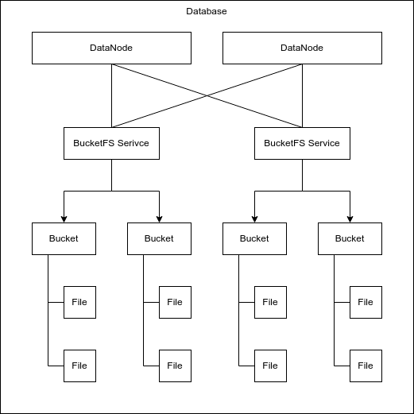

👤 User Guide
==============

Bucketfs
--------
Depending on the database configuration, the bucketfs setup can range from straight forward to fairly complex.
The overview bellow should give you a rough idea about the bucketfs system in general.
For more details on bucketfs, please have a look in the `bucketfs section`_ of the `database documentation`_.

Quickstart
----------

.. literalinclude:: /examples/quickstart.py
   :language: python3

Follow Up
---------

.. toctree::
    :maxdepth: 1

    basics
    advanced
    upload_github_release_to_bucket

.. _bucketfs section: https://docs.exasol.com/db/latest/database_concepts/bucketfs/bucketfs.htm
.. _database documentation: https://docs.exasol.com/db/latest/home.htm
