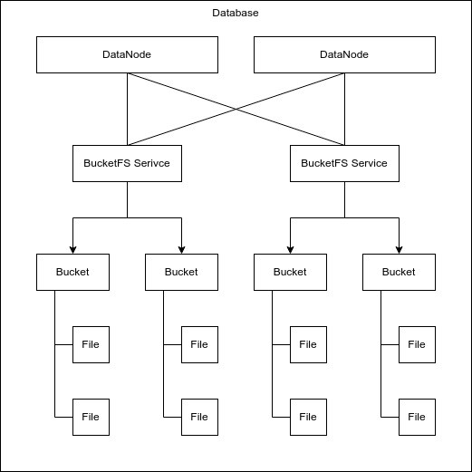

👤 User Guide
==============

Bucketfs
--------
Depending on the database configuration, the bucketfs setup can range from straight forward to fairly complex.
This is due to the fact that:

* Each database can have one or more BucketFS services (applies to On-Prem database instances)
* Each BucketFS service is available on all worker clusters of a database
* Each BucketFS service runs on all data nodes of a database
* Each BucketFS service can have one or more Buckets (applies to On-Prem database instances)
* Each Bucket can hold one or more files

The following overview illustrate this.  For more details on bucketfs, please
also have a look in the `bucketfs section`_ of the `database documentation`_.

Quickstart
----------

.. literalinclude:: /examples/quickstart.py
   :language: python3

Follow Up
---------

.. toctree::
    :maxdepth: 1

    basics
    advanced

.. _bucketfs section: https://docs.exasol.com/db/latest/database_concepts/bucketfs/bucketfs.htm
.. _database documentation: https://docs.exasol.com/db/latest/home.htm
